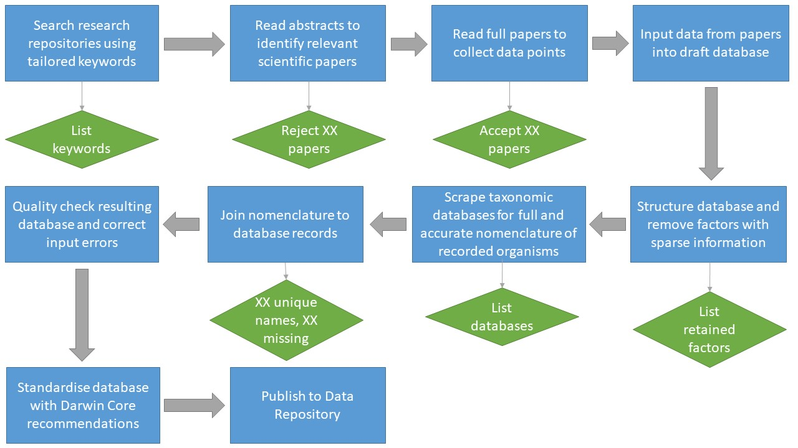

---
#########################################
# options for knitting a single chapter #
#########################################
output:
  bookdown::pdf_document2:
    template: templates/brief_template.tex
    citation_package: biblatex
  bookdown::html_document2: default
  bookdown::word_document2: default
documentclass: book
bibliography: [bibliography/references.bib]
#chapter level bibliography
#bibliography: [bibliography/synth-ref.bib]
params:
  width: 70%
  in_loc: '~/PhD/thesis_git/mac-thesis/data/biosec/'
  fig_out: '~/PhD/thesis_git/mac-thesis/figures/chapter-figs/database'
---

# Organisms associated with anthropogenic marine debris reported in the scientific literature globally from 1990 to 2019  
\chaptermark{OAAMD Database}

```{r setup, include = F}
library(tidyverse)
library(janitor)
library(purrr)
library(kableExtra)
library(ggOceanMaps)
```

```{r load-files, include = F}

pull_dfs <- c("organisms", "papers", "spatial", "taxonomy")
file_type <- c(".csv")

list_dfs <- pull_dfs %>%
  map(~ read.csv(paste0(params$in_loc, ., file_type), encoding = "UTF-8")) %>%
  map(~ na_if(., "")) %>%
  map(~ remove_empty(., which = c("rows", "cols"))) %>%
  map(~ janitor::clean_names(.)) %>%
  map(~ rename_with(., ~str_remove(., "x_u_feff_")))
  
names(list_dfs) <- pull_dfs

list2env(list_dfs, envir = globalenv())

```

```{r prep-data, include = F}

organisms_clean <- organisms %>%
  select(-rank) %>%
  mutate(scientific_name = fct_recode(as.factor(scientific_name),
                                      Actiniaria = "Actinaria",
                                      Amoebophrya = "Amoebophyra"))
#names need further cleaning

df_orgs <- left_join(organisms_clean, taxonomy)

spatial <- spatial %>%
  mutate(lat = as.numeric(str_remove(lat, ",")),
         long = as.numeric(str_remove(long, ","))) %>%
  filter(!is.na(lat))

```

```{r create-database-summary, include = F}

data_sum_labels <- c(
  "Design type(s)",
  "Measurement type(s)",
  "Technology type(s)",
  "Factor type(s)",
  "Sample characteristics")

data_sum_values <- c(
  "Synthetic database - Marine ecology",
  "Taxonomic record",
  "Specialist identification - Environmental DNA - DNA Sequencing",
  "Scientific publication DOI",
  "Spatial coordinates - Lowest taxonomic unit - Substrate material type - Publication year"
)

data_sum_table <- data.frame(
  "Descriptor" = data_sum_labels,
  "Value" = data_sum_values
  )

```

```{r quick stats, include = F}

organism_count <- organisms_clean %>%
  select(paper_id, scientific_name) %>%
  distinct() %>%
  count() %>%
  pull(n) %>%
  format(format = "f", big.mark = ",")

paper_count <- papers %>%
  select(paper_id) %>%
  distinct() %>%
  count() %>%
  pull(n) %>%
  format(format = "f", big.mark = ",")

```

## Abstract  

- Humans have created a novel habitat in the ocean through the discharge of artificial materials like plastics, rubber, and manufactured wood products. The organisms that live and circulate through the marine environment in this new form of habitat have been identified, described, and otherwise published in the scientific record in growing numbers over the past 30 years. Comprehensively collating these records with their standardised taxonomy and corresponding spatial coordinates may aid in efforts to understand this ecosystem and its potential impacts on the rest of the marine environment. 
- This database includes `r organism_count` of these recorded instances of organisms on anthropogenic marine debris (AMD) from `r paper_count` papers in every ocean basin, as well as the Mediterranean and several other seas published between 1992 and 2019.
- Records were pulled from peer-reviewed scientific publications found using tailored keyword searches in Scopus, Web of Science, and ProQuest.  
- Papers returned in the initial queries were then manually assessed for their relevance according to their title and abstract. Those identified as potentially relevant were then read by the researchers to locate and incorporate relevant data included in the text, figures, tables, and appendices into the database. The results of this effort were then joined with validated taxonomic nomenclature from the World Register of Marine Species, Global Biodiversity Information Facility, and  Integrated Taxonomic Information System. The broad marine region specified in each publication was manually noted along with the available spatial coordinates for the study as a whole from in-text description and georeferenced maps.
- The resulting database can be accessed from the stable link provided along with this publication.  
- Combining the taxonomic information in this database with trait or behavioural databases, such as XXXX, could yield insights into how these ecosystems assemble and function. Further detail could be added and spatial analysis performed by merging this database with oceanographic data available from XXXX or XXXX. 

### Corresponding author  

Correspondence and requests for materials should be directed to \textbf{C. M. (email: c.c.mcmains@gmail.com)}.  

```{r summary-table, echo = F, fig.scap = "Database description", out.width = params$width}

kable(data_sum_table, "latex", booktabs = T, col.names = NULL,
      caption = "Summary description of synthetic database") %>%
  kable_styling(latex_options = "scale_down")

```

## Background & Summary  
- Popularisation of plastic as a material for diverse uses in our daily lives has lead to a large and increasing amount of artificial materials in the world's oceans. Collectively referred to as anthropogenic marine debris (AMD), these substrates comprised of plastics, rubber, and manufactured wood products, among other solid wastes from human activities in oceans and seas, also represent a novel type of habitat that is growing increasingly common. [cite]   
- Scientific literature documented organisms associated with AMD as early as the 1970's [cite], with more frequent and detailed records growing in number since the 1990's [cite]. Researchers investigating the phenomenon of plastic pollution across its varied dimensions have often included secondary remarks of life attached to their study materials. A smaller subset of researchers has specifically studied the organisms themselves. Due to the diverse nature of the disciplines and modalities, records vary significantly across all meaningful dimensions, from collection methods through to how they are reported.  
- Previous efforts towards compiling these records have resulted in several review papers [cites]. In one case, collaboration across disciplines resulted in a comprehensive database of all organisms attached to catalogued debris suspected to originate from the 2015 tsunami that occurred along the coast of Japan's Tohuku prefecture [cite]. This database however, represents the first resource tailored for analysis of organisms associated with AMD globally from a comprehensive search of scientific publications and includes all of the records from these cited previous efforts. 
- The database also not only contains records of identified organisms, but further includes information on methodology, substrate materials, and spatial co-ordinates. However, these variables were often only reported at the study level and not associated with individual organisms. Associations between them and the organisms are therefore not suitable for investigation using most types of statistical analysis.  
- Taxonomic identifications of organisms in their source material have been joined to their currently accepted nomenclature as of March 2020 available from specialist-maintained open taxonomic databases and include stable identifiers. Substrate materials as reported in the literature have also been associated with standardised contemporary nomenclature from IUPAC [cite] and the DOI or ISBN is included for each publication within the database. Where relevant, each variable in the database has been named according to the Darwin Core Standard [cite]. This has all been done to facilitate the use of this database alongside others and as disciplines inevitably update their nomenclature.  
- It may be useful to combine this database with others containing more detailed data on the organisms' evolutionary biology, physical traits, behaviour, or ecological function. Spatial analyses may georeference the coordinates of this database into marine regions of varying scope, such as through almanacs available through XXXX [cite].  
- Used alone, this database shows an increasing scientific interest in this novel ecosystem and changes in the way that it is studied. Molecular techniques have yielded a boom in the known diversity of organisms on AMD, particularly for bacteria and fungi. It also highlights the need for more research in the Southern Hemisphere and research in general. Almost all organisms were recorded only once or twice.  
- While this database has the potential to yield important findings, its sparse nature relative to the known diversity of organisms and environments in the world's oceans is also likely to support the need for more research across disciplines. 
- In its current state, it may be particularly useful for those researching the impacts of AMD on coastal environments. This database can be easily combined with new findings to provide background and context. It may also be useful for tracking the locations or spread of invasive species for biosecurity researchers and marine resource managers.  
- Trends found in this database should be presented with the caveat that there is an immense number of potential external sources that could not be captured or reported.  Findings related to materials should be carefully considered because reporting of which organisms was attached to which substrate was so rarely done that it could not be reliably recorded in this database. Spatial trends should also be considered judisciously due to the lack of tie between specific points and organisms. Studies with large spatial scopes should be removed prior to any spatial analysis. It is also worth noting that data from the Japanese Tsunami Marine Debris (JTMD) database [cite], paper ID 999, has far more detailed and validated records than any other, which may skew results from the North Pacific unless accounted for.  
- The database is separated into five primary tables linked by two primary identifiers (Table XX). Identifiers are unique keys at the highest record levels: study and accepted taxonomic nomenclature. Study level variables include data that was reported most often in the methods section of the paper, like methodology and sampling locations. While material types were reported in the results section, these too were often reported at the level of the study itself and are therefore linked to the unique study identifier. Both accepted and utilised taxonomic nomenclature for the most detailed identification available, or lowest taxonomic unit (LTU), of every identified organism is the second primary identifying key. This links each organism to its correct nomenclature and enables systematic validation and updates as necessary.  
- All of the data originates in peer-reviewed scientific literature published and returned in searches for the specified queries in three major research repositories (Table XX) between 1992 and 2019. Organisms were recorded on debris items collected from, or deliberately immersed and naturally colonised in, the marine environment during the course of formal scientific research. The database contains records from all marine environments globally, from beaches to salt marshes and deep sea trenches. It only contains what the researchers reported in their publications, not neccessarily all of the organisms found or identified. 
- It is recommended that users of this database update the taxonomic nomenclature using the noted databases and database IDs provided. Where material types are relevant, it is also recommended to reference current IUPC nomenclature and ensure that materials are described using contemporary naming conventions. Spatial coordinates are provided with descriptive quality ratings to assist in analyses where accuracy is important. However, no particular level of accuracy is guaranteed. For a guide on how to join the different tables, see the diagram included in Appendix XX. 
- This database is provided in static format at the stable location associated with this publication. Any dynamic or updated versions of this database should reference this publication and be discoverable using that reference.
- At the time of this publication there is no update schedule and no plans exist to provide this resource in any other format. 

## Methods  
- Overview of methods used to collect the field data.  
- Explain where to find examples of each general method or a review paper describing various methods in detail.  
- Overview of most common methods to process the field data.  
- Brief comparison of these methods.  
- Mention of other methods possible to use but not included in the dataset and description of reason why they were excluded.  
- Describe how methods many be affected by different common scenarios that present in the field and lab.  
- Delineate sources of data compiled into the database.  
- Describe how data were accessed.  
- Describe how data was filtered for relevancy.  
- Describe how data was made to fit into a standardised data resource.  
- Describe how ongoing maintenance or updating would be performed.  

### Figures  

```{r buffer-function, include = F}

addBuffer <- function(.num_vec, .buffer) {
  out_vec <- c()
    for (i in .num_vec) {
      if (i <= 0) {
        out <- i - .buffer
        } else {
          out <- i + .buffer
          }
      out_vec <- c(out_vec, out)
      }
  return(out_vec)
  }

```

```{r prep-map-data, include = F}

map_buffer <- 2
lat_lims <- c(min(spatial$lat), max(spatial$lat))
long_lims <- c(min(spatial$long), max(spatial$long))

map_bounds <- data.frame(lon = c(rep(long_lims[1],2),
                                 rep(long_lims[2], 2)),
                         lat = c(lat_lims[1],
                                 rep(lat_lims[2], 2),
                                 lat_lims[1])) %>%
  mutate_all(~addBuffer(., map_buffer)) %>%
  mutate_all(~round(., 1)) %>%
  mutate_all(~as.numeric(.))

map_data <- spatial %>%
  mutate(spot_id = ifelse(paper_id == 999, site, paper_id)) %>%
  select(paper_id, spot_id, lat, long) %>%
  mutate(lat = round(lat, 1),
         lon = round(long, 1)) %>%
  distinct() %>%
  left_join(select(papers, paper_id, environ)) %>%
  mutate(environ = str_replace_all(environ, "Benthic \\[Deep\\]", "Benthic"),
         environ = str_replace_all(environ, "Benthic; Benthic", "Benthic"),
         environ = str_replace_all(environ, "Beach; Benthic; Floating", "All"),
         environ = str_replace_all(environ, "Floating; Benthic", "Benthic; Floating"),
         environ = str_replace_all(environ, "Floating; Beach", "Beach; Floating"),
         environ = str_replace_all(environ, ";", " \\&")) %>%
  select(lat, lon, environ)

```

```{r map-records, echo = F, fig.cap = "Global distribution of sampling sites within publications describing organisms associated with AMD.", fig.scap = "Map of database sampling sites", fig.height = 4, fig.width = 5.5, warning = F, error = F, message = F}

basemap(data = map_bounds, lat.interval = 30,
        land.col = 'grey95', land.border.col = "grey95", land.size = 0.1) +
  geom_point(data = map_data,
             mapping = aes(y = lat, x = lon, color = environ, fill = environ),
             shape = 21, alpha = 0.5, size = 1.5) +
  labs(x = "Longitude",
       y = "Latitude") +
  scale_fill_manual(name = "Collection\nenvironment",
                    values = RColorBrewer::brewer.pal(7, "Accent")) +
  scale_color_manual(name = "Collection\nenvironment",
                    values = RColorBrewer::brewer.pal(7, "Accent")) +
  theme(panel.background = element_rect(fill = "grey30"),
        panel.grid.major = element_line(color = "grey15", size = 0.5),
        panel.ontop = F,
        legend.title = element_text(face = "bold"),
        legend.key = element_rect(fill = "grey30", color = "black"))

```

```{r group-taxa, include = F}

morpho_list <- tibble(
    Kingdom = list(
      Group = list(
        Microbial = list(Taxon = list("Bacteria", "Archaea", "Eukaryota", "Protozoa", "Metazoa", "Fungi")),
        Photosynthetic = list(Taxon = list("Plantae", "Chromista"))
        )
      ),
    Phylum = list(
      Group = list(
        Microbial = list(Taxon = list("Gastrotricha", "Loricifera")),
        Worm = list(Taxon = list("Annelida", "Nemertea", "Platyhelminthes", "Sipuncula", "Chaetognatha")),
        Biofouling = list(Taxon = list("Bryozoa", "Cnidaria", "Echinodermata", "Entoprocta", "Porifera")),
        Other = list(Taxon = list("Ctenophora", "Nematoda", "Priapulida")),
        Mollusk = list(Taxon = list("Mollusca")),
        Arthropod = list(Taxon = list("Arthropoda"))
        )
      ),
    Class = list(
      Group = list(
        Biofouling = list(Taxon = list("Ascidiacea")),
        Other = list(Taxon = list("Actinopterygii", "Elasmobranchii", "Teleostei"))
      )
    )
  ) 
  
taxon_key <- morpho_list %>%
  gather(key = "Level") %>%
  unnest_longer(value, indices_to = "Group") %>%
  unnest_longer(value, values_to = "taxon_group", indices_include = F) %>%
  unnest_longer(taxon_group, indices_include = F)

```

```{r prep-records-data, include = F}

record_df <- df_orgs %>%
  mutate(taxon_group = ifelse(kingdom == "Animalia", phylum, kingdom),
         taxon_group = ifelse(taxon_group == "Chordata", class, taxon_group)) %>%
  left_join(taxon_key) %>%
  rename(morph_group = Group) %>%
  mutate(morph_group = fct_explicit_na(morph_group, "Other")) %>%
  group_by(paper_id, morph_group) %>%
  count() %>%
  left_join(select(papers, paper_id, year_pub)) %>%
  ungroup() %>%
  mutate(year_pub = as.numeric(ifelse(paper_id == "999", 2022, year_pub))) %>%
  group_by(year_pub, morph_group) %>%
  summarise(taxon_count = sum(n)) %>%
  group_by(year_pub) %>%
  mutate(year_count = sum(taxon_count)) %>%
  ungroup() %>%
  complete(year_pub = 1995:2019, fill = list(year_count = 0, taxon_count = NA)) %>%
  arrange(year_pub, desc(year_count)) %>%
  mutate(year_count = ifelse(duplicated(year_pub), NA, year_count))

```

```{r prep-pub-data, include = F}

pub_df <- papers %>%
  select(year_pub, paper_id) %>%
  filter(paper_id != "999") %>%
  distinct() %>%
  group_by(year_pub) %>%
  count() %>%
  ungroup() %>%
  complete(year_pub = 1995:2019, fill = list(n = 0))

```

```{r taxon-table, echo = F, out.width = params$width, fig.scap = "Table of morphological groups"}

taxon_key %>%
  group_by(Group, Level) %>%
  summarise(Taxa = paste(taxon_group, collapse = ", "),
            .groups = "drop") %>%
  kable("latex", booktabs = T,
        caption = "Grouping of identified organisms into morphological categories by taxonomy.")  %>%
  kable_styling(latex_options = "scale_down")

```


```{r yearly-records, echo = F, fig.cap = "Yearly counts of publications and records of identified organisms on AMD in the scientific literature.", fig.scap = "Database publications & records by year", fig.width = 6.5, fig.height = 3.5, warning = F, error = F, message = F}

record_df %>%
  ungroup() %>%
  filter(year_pub != 2022) %>%
  ggplot() +
  geom_bar(aes(x = year_pub, y = taxon_count, fill = morph_group),
           color = "grey40", size = 0.1, stat = "identity", width = 0.5,
           na.rm = T, alpha = 0.7) +
  geom_text(aes(x = year_pub, y = year_count + 30, label = year_count),
            size = rel(2), color = "grey10") +
  theme_minimal() +
  guides(fill = guide_legend(title = "Morphology", nrow = 1)) +
  theme(legend.position = "top", 
        legend.title = element_text(face = "bold", size = rel(0.8)),
        legend.text = element_text(size = rel(0.8)),
        legend.key.size = unit(5, "points"),
        axis.text.y = element_text(size = rel(0.8)),
        axis.text.x = element_text(angle = 30, hjust = 1, size = rel(0.8)),
        axis.title = element_text(size = rel(0.9))) +
  scale_x_continuous(limits = c(1994.1, 2019.9), breaks = scales::breaks_width(1),
                     expand = expansion(0)) +
  labs(x = "Publication Year",
       y = "All Organisms Recorded")

```

```{r process-diagram, echo = F, out.width = 100%, fig.cap = "Diagram of the process used to gather and integrate publised records of organisms associated with AMD into the database.", fig.scap = "Database creation process diagram"}



```

## Data Records  
- Define the lowest level of record and what it describes (include def of identifier)  
- Describe how lowest records are linked through to other levels.  
- Describe highest level of record and why it collects the lower levels.  
- How metadata is linked to the dataset.  
- Any caveats to the above, like why multiple names of a species might be attached to a record.  
- Quality assurances for each record and how they were validated.  

## Technical Validation  
- How data was cleaned and prepared in a way that needs to be acknowledged in any analysis.  
- How data quality issues were addressed in the records that were lower quality but still met the minimum standards to be included.  
- Any conversions of preparations that may be confusion to a user at first.  
- Null or missing value signifiers.  

## Usage Notes  
- Where the data has been made available for use.  
- Suggest complementary datasets.  
- Suggest how to link the data through to those complementary sets.  
- Examples of how this type of data has been used in projects or publications in combination with other sources.  
- Common reasons that the dataset admin would be contacted.  
- How to contact the dataset admin.  
- Where to go for more information about the dataset.  

### Data Citation  
\emph{citation of dataset in stable repository}  

### Acknowledgements  
The records synthesised in this database were collected and described through the efforts of academic scientists and researchers, community scientists, and scientific professionals from around the world. We acknowledge their contributions to the body of knowledge compiled in this database and encourage further engagement with their published literature in our citation list. Where records from only one publication are used in continuing research, we recommend citing the publication directly or per the custodian's information. In the case where records from multiple sources were used from this database, this publication should be cited directly. This provenance can be determined using the publication identifier linked to every record in the database. For data originating from the Japanese Tsunami Marine Debris database, the work of Carlton et. al should be cited directly or in addition to this database.  

### Author Contributions  
C.M. designed the methodology, performed all steps of the compilation and preparation of this database, and wrote the manuscript. C.L.H. and M.L.C. advised on the project concept and database synthesis. M.B. and C.L.H. provided significant assistance with and review of the manuscript and advised on data cleaning and validation. J.M. and M.L.C. also assisted with the manuscript review. Further details on author contributions can be found in Table 1 provided with the online version of this manuscript.  

### Additional Information  
The table of detailed authorship contributions is only available in the online version of this paper.  

\textbf{Competing Interests}  
The authors declare no competing financial interests.  

\textbf{Appendices}  
Create a table of detailed description of each authors contribution per the publisher's requirements.  


